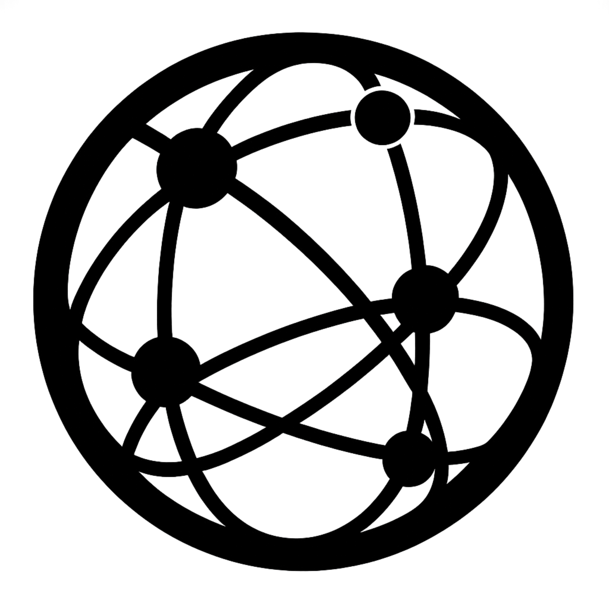

  

<h1 align="center">SupplyGraph AI</h1>
<h3 align="center">AI-Native Supply Graph Intelligence Platform</h3>

  
  
  
  
  

Autonomous, auditable, and real-time supply-chain intelligence that maps how companies, products, and geographies connect across the global economy — enabling visibility, resilience, and efficiency <b>without requiring any customer-provided data</b>.

## Table of Contents
1. [Introduction](#introduction)  
2. [What We Do](#what-we-do)  
3. [Why It Matters](#why-it-matters)  
4. [How It Works](#how-it-works)  
5. [Two Groups of AI Agents](#two-groups-of-ai-agents)  
6. [Integration & Developer Experience](#integration--developer-experience)  
7. [Who Uses SupplyGraph AI](#who-uses-supplygraph-ai)  
8. [Why We’re Different](#why-were-different)  
9. [Real Results Across Industries](#real-results-across-industries)  
10. [Security & Privacy](#security--privacy)  
11. [About SupplyGraph AI](#about-supplygraph-ai)  
12. [Contact](#contact)

## Introduction
**SupplyGraph AI** delivers real-time global supply graph intelligence — an AI-native risk infrastructure that reveals multi-hop visibility with auditable analytics for enterprises, financial institutions, and public stakeholders.

## What We Do
We map how products, companies, and geographies connect across extended supply networks, surfacing risks and validated alternatives in real time.  
Our AI-native graph infrastructure powers multi-hop visibility so teams can see, simulate, and secure complex value chains without adding tooling overhead.

## Why It Matters
Legacy solutions rarely reach beyond Tier 1–2 and depend heavily on static, probabilistic data or user-uploaded supplier lists.  
SupplyGraph AI eliminates these blind spots, exposing 10+ tiers of verified enterprise-product relationships with explainable, source-linked evidence.

## How It Works
We maintain a continuously updated graph of hundreds of millions of enterprise records and millions of product nodes.  
Each relationship is tied to live signals and an auditable evidence chain.  

✅ **No customer data required** — our enterprise-centric design removes the need for supplier uploads, minimizing disclosure risk while accelerating time-to-value.

## Two Groups of AI Agents

### Group 1: Automation & Efficiency Agents
Automate repetitive and time-consuming workflows:
- **Customs Classification Agent** — Maps products to correct HS/HTS codes.  
- **Tariff Calculation Agent** — Calculates U.S. duty rates and additional tariffs.  
- **Tariff Monitoring Agent** — Detects tariff changes and sends actionable alerts.  
- **Due Diligence Agent** — Generates multi-industry company intelligence in minutes.

### Group 2: Data Intelligence & Supply Graph Agents
Deliver enterprise-centered global supply–product graph intelligence:
- **Global Supply Dependency Visualization Agent** — Visualizes multi-tier supply dependencies across global companies and products.  
- **Single-Country Concentration Risk Agent** — Identifies hidden geographic dependencies and quantifies country-level exposure.  
- **Tier-1 Supplier Discovery Agent** — Finds qualified, low-risk Tier-1 suppliers worldwide within minutes.  
- **Regional Substitution Recommendation Agent** — Recommends practical regional supplier alternatives to strengthen resilience.

## Integration & Developer Experience
Our platform is designed for **fast, standards-based integration**:
- **RESTful APIs** — Simple, secure, schema-stable endpoints.  
- **Agent-to-Agent (A2A) and MCP Interfaces** — Built on industry standards for interoperability.  
- **Integration Time:** Typically **15–30 minutes** for most enterprise environments.  

**Ideal for:**  
AI engineers, data-science teams, supply-chain developers, and risk-automation architects building intelligent enterprise workflows.

For full setup, authentication, and API key usage, see the [Getting Started Guide](./docs/getting-started.md).

## Who Uses SupplyGraph AI
**SupplyGraph AI** is built for organizations and developers who depend on complex, global supply networks:  

- **Manufacturing & Automotive Enterprises** — Manage supplier dependencies, sourcing diversification, and tariff impact.  
- **Energy, Electronics & Industrial Companies** — Monitor upstream material risks and regional concentration exposure.  
- **Retail & Consumer Goods Brands** — Evaluate supply resilience, compliance, and substitution opportunities.  
- **Consulting & Risk Advisory Firms** — Embed automated due diligence and risk intelligence into client workflows.  
- **Financial Institutions & Investors** — Analyze network-based exposure for portfolio or credit risk modeling.  
- **Public Sector & Research Institutes** — Model supply interdependencies, concentration trends, and policy scenarios.  

## Why We’re Different
- **10+ tier visibility** — Exposes deep-tier dependencies unseen by legacy tools.  
- **Real-time updates** — Continuously refreshed global graph data.  
- **Auditable analytics** — Every output backed by verifiable evidence.  
- **Zero data dependency** — No customer-provided data required.  
- **Zero hallucination** — Fully explainable, policy-aware AI reasoning.

## Real Results Across Industries

| Sector | Impact Example |
|:-------|:----------------|
| **Supply Chain Management** | Global 500 client reduced tariff filing time from hours to minutes with our Tariff Monitoring Suite. |
| **Consulting** | Embedded our Due Diligence Suite into advisory workflows, cutting analysis time by 90%. |
| **Financial Services** | Extended visibility from Tier-3 to Tier-10 suppliers through A2A integration. |
| **Research** | Enabled new empirical studies with verified supply-chain datasets. |
| **Government** | Supported policy simulations and concentration analytics for regulatory planning. |

## Security & Privacy
Insights are built from enterprise–product relationships and open signals.  
Customer data is never required nor stored.  
Every analytic output maintains a **verifiable evidence trail**, ensuring transparency, compliance, and audit readiness.

## About SupplyGraph AI
**SupplyGraph AI** redefines how the world understands and secures supply chains.  
Through autonomous graph intelligence, we empower organizations to predict risks, optimize operations, and act with confidence — all without sharing private data.

## Contact
For partnerships, integrations, or research collaborations:  
📧 **info@supplygraph.ai**  
🌐 [https://www.supplygraph.ai](https://www.supplygraph.ai)  

  © 2025 <b>SupplyGraph AI, Inc.</b> All rights reserved.  

